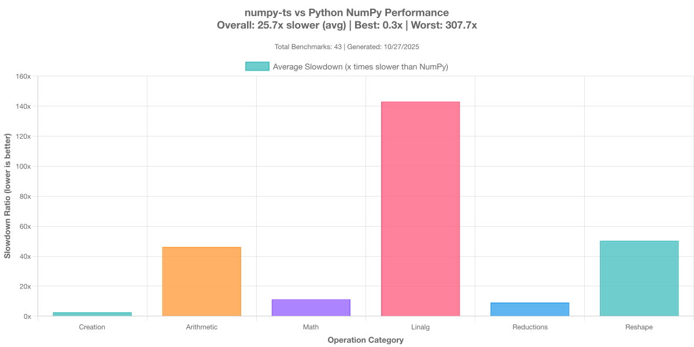

# numpy-ts

Complete NumPy implementation for TypeScript and JavaScript

[](https://opensource.org/licenses/MIT)


**⚠️ WARNING: This project is under construction and is currently unstable. Expect breaking changes.**

---

## What is numpy-ts?

A complete, functionally-equivalent implementation of NumPy 2.0+ for the TypeScript/JavaScript ecosystem. (At least that's the goal!)

### Goals

- ✅ **100% NumPy 2.0+ API** - All 800+ functions
- ✅ **Full Type Safety** - Complete TypeScript definitions
- ✅ **Cross-Platform** - Node.js and browsers
- ✅ **File Compatibility** - Read/write .npy and .npz files
- ✅ **Correctness First** - Validated against Python NumPy

### Not Goals

- ❌ Matching Python NumPy's exact performance (initially)
- ❌ C API compatibility
- ❌ Legacy NumPy 1.x deprecated functions

---

## Quick Example

```typescript
import * as np from 'numpy-ts';

// Create arrays (default float64 dtype)
const A = np.array([[1, 2], [3, 4]]);
const B = np.zeros([2, 2]);

// Create arrays with specific dtypes (11 types supported)
const intArr = np.ones([3, 3], 'int32');
const floatArr = np.arange(0, 10, 1, 'float32');
const boolArr = np.array([1, 0, 1], 'bool');
const bigIntArr = np.array([1n, 2n, 3n], 'int64');  // BigInt support

// All operations preserve dtype or follow NumPy promotion rules
const result = intArr.add(5);  // Stays int32
const promoted = intArr.add(floatArr);  // Promotes to float32

// Matrix operations
const C = A.matmul(B);
const eigenvalues = np.linalg.eig(A);

// Slicing (string-based syntax)
const row = A.slice('0', ':');  // First row
const col = A.col(1);            // Second column

// Broadcasting (fully implemented!)
const scaled = A.add(5).multiply(2);

// Advanced broadcasting examples:
const row = np.array([1, 2, 3, 4]);        // (4,)
const col = np.array([[1], [2], [3]]);     // (3, 1)
const result = col.multiply(row);           // (3, 4) via broadcasting!

// Reductions
const total = A.sum();                // Sum all elements
const columnMeans = A.mean(0);        // Mean along axis 0
const rowMaxs = A.max(1, true);       // Max along axis 1, keep dims

// Comparisons (return boolean arrays as uint8)
const mask = A.greater(5);            // Element-wise A > 5
const equal = A.equal(B);             // Element-wise A == B
const inRange = A.greater_equal(0);   // A >= 0

// Tolerance comparisons (for floating point)
const close = A.isclose(B);           // Element-wise closeness
const allClose = A.allclose(B);       // True if all elements close

// Reshape operations (view vs copy semantics)
const reshaped = A.reshape(4, 1);     // View if C-contiguous, copy otherwise
const flat = A.flatten();             // Always returns a copy
const ravel = A.ravel();              // View if C-contiguous, copy otherwise
const transposed = A.transpose();      // Always returns a view
const squeezed = A.squeeze();          // Always returns a view
const expanded = A.expand_dims(0);     // Always returns a view

// View tracking (NumPy-compatible)
const view = A.slice('0:2', '0:2');
console.log(view.base === A);         // true - view tracks base array
console.log(view.flags.OWNDATA);      // false - doesn't own data
console.log(A.flags.OWNDATA);         // true - owns data

// Memory layout flags
console.log(A.flags.C_CONTIGUOUS);    // true - C-order (row-major)
console.log(A.flags.F_CONTIGUOUS);    // false - not Fortran-order

// Random
const random = np.random.randn([100, 100]);

// I/O (Node.js)
np.save('matrix.npy', A);
const loaded = np.load('matrix.npy');
```

---

## Architecture

```
┌────────────────────────────────┐
│    NumPy-Compatible API        │
└────────────┬───────────────────┘
             │
┌────────────┴───────────────────┐
│  NDArray (Memory & Views)      │
│  Broadcasting, Slicing, DTypes │
└────────────┬───────────────────┘
             │
┌────────────┴───────────────────┐
│  Computational Backend         │
│  @stdlib (BLAS/LAPACK)         │
└────────────────────────────────┘
```

**We build**: NumPy API, NDArray class, broadcasting, slicing, view tracking

**We use**: @stdlib for proven numerical computations

---

## Key Features

### Comprehensive NumPy API
- **Array creation**: `zeros`, `ones`, `arange`, `linspace` (all support dtype parameter)
- **Arithmetic operations**: `add`, `subtract`, `multiply`, `divide` with broadcasting
- **Linear algebra**: `matmul` (using optimized BLAS)
- **Reductions**: `sum`, `mean`, `std`, `min`, `max` with axis support
- **DTypes**: 11 types supported (float32/64, int8/16/32/64, uint8/16/32/64, bool)
  - Full dtype preservation across operations
  - NumPy-compatible type promotion
  - BigInt support for int64/uint64
- **View tracking**: `base` attribute tracks view relationships
- **Memory flags**: `C_CONTIGUOUS`, `F_CONTIGUOUS`, `OWNDATA`
- **Comparisons**: `greater`, `less`, `equal`, `isclose`, `allclose`
- **Reshaping**: `reshape`, `flatten`, `ravel`, `transpose`, `squeeze`, `expand_dims`

### TypeScript Native
```typescript
// Full type inference
const arr = np.zeros([3, 4]);  // Type: NDArray<Float64>
arr.shape;  // Type: readonly [3, 4]
arr.sum();  // Type: number

// Type-safe slicing
arr.slice('0:2', ':');  // Returns NDArray
arr.get([0, 1]);        // Returns number
```

### Slicing Syntax

Since TypeScript doesn't support Python's `arr[0:5, :]` syntax, we use strings:

```typescript
// String-based (primary)
arr.slice('0:5', '1:3');     // arr[0:5, 1:3]
arr.slice(':', '-1');        // arr[:, -1]
arr.slice('::2');            // arr[::2]

// Convenience helpers
arr.row(0);                  // arr[0, :]
arr.col(2);                  // arr[:, 2]
arr.rows(0, 5);              // arr[0:5, :]
arr.cols(1, 3);              // arr[:, 1:3]
```

### Broadcasting

Automatic NumPy-style broadcasting:

```typescript
const a = np.ones([3, 4]);
const b = np.arange(4);
const c = a.add(b);  // (3, 4) + (4,) → (3, 4)
```

---

## Installation

```bash
npm install numpy-ts
```

```typescript
import * as np from 'numpy-ts';
```

---

## Development Status

### Phase 0: Project Setup
- [x] Package configuration
- [x] TypeScript setup
- [x] Build system (esbuild)
- [x] Test framework (Vitest)
- [x] Documentation consolidated
- [x] Linting (ESLint + Prettier)
- [x] @stdlib investigation and integration
- [x] First working implementation


### Phase 1: Core Foundation
- [x] NDArray wrapper class (using @stdlib/ndarray)
- [x] Array creation: `zeros()`, `ones()`, `array()`, `arange()`, `linspace()`, `eye()`
- [x] Matrix operations: `matmul()` using optimized BLAS
- [x] Properties: `shape`, `ndim`, `size`, `dtype`, `data`, `strides`
- [x] View tracking: `base` attribute, `flags` property
- [x] Memory flags: `C_CONTIGUOUS`, `F_CONTIGUOUS`, `OWNDATA`
- [x] Arithmetic operations: `add()`, `subtract()`, `multiply()`, `divide()`, `mod()`, `floor_divide()`, `negative()`, `positive()`, `absolute()`, `sign()`, `reciprocal()`
- [x] Broadcasting - fully integrated into all operations
- [x] String-based slicing - `arr.slice('0:5', ':')`, `row()`, `col()`, etc.
- [x] Reductions with axis support - `sum(axis, keepdims)`, `mean()`, `max()`, `min()`
- [x] Comparison operations - `greater()`, `less()`, `equal()`, `isclose()`, `allclose()`
- [x] Reshape operations - `reshape()`, `flatten()`, `ravel()`, `transpose()`, `squeeze()`, `expand_dims()`
- [x] DType system - 11 types: float32/64, int8/16/32/64, uint8/16/32/64, bool
  - Full dtype preservation
  - NumPy-compatible promotion rules
  - BigInt support for int64/uint64
- [x] Exponential operations - `sqrt()`, `power()`
- [x] Testing
  - Unit tests for all operations
  - NumPy validation tests (cross-checked against Python NumPy 2.3.3)
  - Edge case validation (overflow, underflow, special values)

### Phase 2: Benchmarks & CI/CD
- [X] CI/CD (GitHub Actions)
  - [X] PR workflow
  - [X] Publish workflow
- [ ] Implement benchmarks
  - [ ] Regression (vs. previous runs)
  - [X] Comparison against Python NumPy
  - [ ] Automated in CI/CD

### Phase 3: Essential Operations
- [x] Matrix operations (using @stdlib BLAS)
- [ ] Linear algebra (using @stdlib LAPACK) - eig, svd, qr, etc.
- [x] Reductions with axis support
- [x] Arithmetic functions - 11/11 complete
- [ ] Mathematical functions - 2/40+ (sqrt, power) - trigonometric, exponential, rounding, etc.
- [x] Comparison operations
- [x] dtype consistency testing

### Phase 4: Extended Features
- [ ] Random number generation
- [ ] FFT operations (using fft.js)
- [ ] I/O operations (.npy/.npz)
- [ ] Advanced indexing
- [ ] Complex numbers, datetime
- [ ] Optional WASM mode

See [API-REFERENCE.md](./docs/API-REFERENCE.md) for complete function checklist.

---

## Documentation

### User Documentation
- [API-REFERENCE.md](./docs/API-REFERENCE.md) - Complete API checklist

### Developer Documentation
- [ARCHITECTURE.md](./docs/ARCHITECTURE.md) - Design and implementation details
- [TESTING-GUIDE.md](./docs/TESTING-GUIDE.md) - How to add tests (unit, validation, benchmarks)
- [benchmarks/README.md](./benchmarks/README.md) - Performance benchmarking guide

---

## Testing

Two-tier testing strategy:

1. **Unit Tests** - Test our implementation
2. **Python Comparison** - Validate against NumPy

```typescript
// Unit test
it('creates 2D array of zeros', () => {
  const arr = np.zeros([2, 3]);
  expect(arr.shape).toEqual([2, 3]);
  expect(arr.sum()).toBe(0);
});

// NumPy validation (cross-checked against Python)
it('matmul matches NumPy', () => {
  const A = np.array([[1, 2], [3, 4]]);
  const B = np.array([[5, 6], [7, 8]]);
  const result = A.matmul(B);

  const npResult = runNumPy(`
    A = np.array([[1, 2], [3, 4]])
    B = np.array([[5, 6], [7, 8]])
    result = A @ B
  `);

  expect(result.toArray()).toEqual(npResult);
});

// Edge case validation
it('int8 overflow wraps like NumPy', () => {
  const arr = np.array([127], 'int8');
  const result = arr.add(1);
  expect(result.get([0])).toBe(-128);  // Wraps like NumPy
});
```

---

## Design Decisions

### 1. BigInt for int64/uint64
Exact representation over convenience. Different type but no precision loss.

### 2. No Complex Number Support (for now)
Removed in favor of simplicity and focus on core numeric types. Can be added back if there's demand.

### 3. String-Based Slicing
`arr.slice('0:5', ':')` instead of `arr[0:5, :]` - TypeScript limitation, Pythonic compromise.

### 4. View Tracking
Track base array for views with `base` attribute. Enables zero-copy optimizations and matches NumPy semantics.

### 5. @stdlib Under the Hood
Use battle-tested BLAS/LAPACK implementations. Focus on API, not reimplementing algorithms.

### 6. Correctness First
Validate everything against Python NumPy before optimizing. WASM/SIMD later.

See [ARCHITECTURE.md](./docs/ARCHITECTURE.md) for full rationale.

---

## Contributing

Project is in early development. We welcome contributions!

### Setup

```bash
git clone https://github.com/dupontcyborg/numpy-ts.git
cd numpy-ts
npm install
npm test
```

### Adding New Features

1. Pick a function from [API-REFERENCE.md](./docs/API-REFERENCE.md)
2. Follow the [TESTING-GUIDE.md](./docs/TESTING-GUIDE.md) to add:
   - Implementation in `src/`
   - Unit tests in `tests/unit/`
   - NumPy validation tests in `tests/validation/`
   - Performance benchmarks in `benchmarks/`
3. Ensure all tests pass: `npm test`
4. Run benchmarks: `npm run bench:quick`
5. Submit a pull request

See [TESTING-GUIDE.md](./docs/TESTING-GUIDE.md) for detailed instructions on adding tests.

---

## Comparison with Alternatives

| Feature | numpy-ts | numjs | ndarray | TensorFlow.js |
|---------|----------|-------|---------|---------------|
| API Coverage | 100% NumPy | ~20% | Different | ML-focused |
| TypeScript | Native | Partial | No | Yes |
| .npy files | Yes | No | No | No |
| Python-compatible | Yes | Mostly | No | No |
| Size | TBD | Small | Tiny | Large |

---

## Benchmarking

Compare numpy-ts performance against Python NumPy:

```bash
# Run quick benchmarks (~1-2 min)
npm run bench:quick

# Run standard benchmarks (~5-10 min)
npm run bench

# Run comprehensive benchmarks (~30-60 min)
npm run bench:full

# View interactive HTML report
npm run bench:view
```

### Performance Overview



See [benchmarks/README.md](./benchmarks/README.md) for detailed benchmarking guide.

---

## Performance Expectations

**v1.0** (Pure JS + @stdlib):
- 10-100x slower than NumPy - acceptable for correctness focus

**v2.0** (Selective WASM):
- 2-20x slower - optimized bottlenecks only

**v3.0** (Advanced):
- 1-10x slower - SIMD, GPU for specific operations

Focus is correctness and completeness first, then performance.

---

## License

[MIT License](./LICENSE) - Copyright (c) 2025 Nicolas Dupont

---

## Links

- **Documentation**: [`docs/`](./docs)
- **NumPy**: https://numpy.org/
- **@stdlib**: https://stdlib.io/
- **Issues**: https://github.com/dupontcyborg/numpy-ts/issues

---

**Ready to bring NumPy to TypeScript + JavaScript!** ⭐
